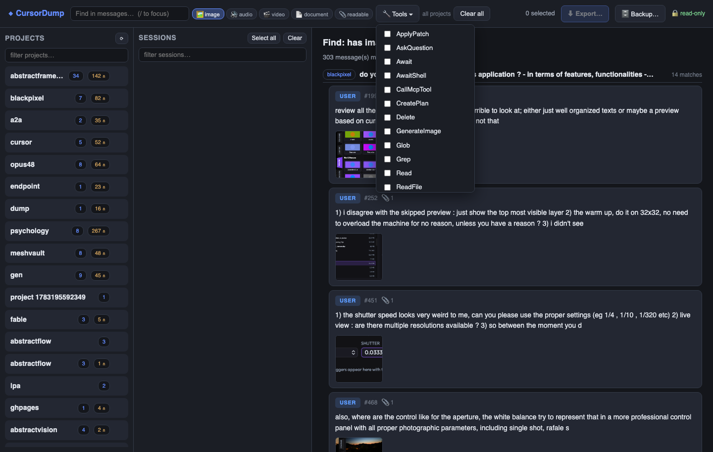

# CursorDump

Explore your Cursor IDE agent sessions, export them as training-ready datasets
for supervised fine-tuning (SFT) and continued pre-training (CPT), and make
complete, Cursor-independent backups of your agent history.



CursorDump is a single Rust binary that serves a local web UI (and a headless
CLI) over the transcripts Cursor stores under `~/.cursor/projects/`. Access to
that data is strictly read-only: running agent sessions are never altered,
locked, or disturbed.

## Capabilities

- **Browse** every Cursor project on your machine, with per-project session
  lists. Subagent transcripts nest under the master session that spawned them.
- **Explore** sessions message by message: user queries, assistant answers,
  collapsible thinking traces, expandable tool calls, and inline attachments
  (images, audio/video players, file chips).
- **Find** messages with one unified finder: keyword + attachment media type +
  tool used, combined. Results are the exact messages that match, with image
  thumbnails; click to jump to the message in its session.
- **Export** any selection of sessions as SFT (ChatML, ShareGPT) and CPT
  (JSONL corpus, plain-text files) datasets, directly usable by
  [Unsloth](https://unsloth.ai/docs/get-started/fine-tuning-llms-guide/datasets-guide)
  (including Unsloth Studio), [ForgeLLM](https://github.com/lpalbou/ForgeLLM),
  and anything that reads HuggingFace `datasets`. Thinking traces, tool calls,
  and subagent delegations are handled with configurable, training-aware
  policies, and every export scans its output for leaked credentials
  (optional redaction).
- **Back up** all (or selected) projects verbatim and incrementally — every
  transcript, subagent, asset, upload, and canvas — with per-transcript
  sha256 integrity records. The backup bundles the `cursordump` binary, so
  you can re-explore it even on a machine without Cursor.

## Installation

**Prebuilt binary (macOS arm64/x86_64, Linux x86_64/arm64)** — no Rust
toolchain needed:

```bash
curl -fsSL https://raw.githubusercontent.com/lpalbou/cursordump/main/install.sh | sh
```

The script downloads the latest
[GitHub release](https://github.com/lpalbou/cursordump/releases), verifies
its sha256 (mandatory), and installs to `~/.local/bin` (override with
`CURSORDUMP_BIN_DIR`; pin a version with `CURSORDUMP_VERSION=vX.Y.Z`). Linux
binaries are static (musl) and run on any distribution. You can also
download an archive from the releases page manually.

**Homebrew** (macOS and Linux):

```bash
brew install lpalbou/tap/cursordump
```

**Cargo** (crates.io, requires Rust stable 1.75+):

```bash
cargo install cursordump
```

**From source**:

```bash
git clone https://github.com/lpalbou/cursordump
cd cursordump
cargo install --path .        # or: cargo run --release
```

## Quick start

```bash
cursordump                     # opens http://127.0.0.1:7070 in your browser
cursordump --port 7075         # custom port
cursordump --no-open           # print the URL instead of opening a browser
cursordump /path/to/projects   # explore a custom root (e.g. a backup)
```

Then, in the UI: pick a project (left), tick the sessions you want (middle),
and press **⬇ Export for training…** or **🗄 Create backup…** (top bar). See
[docs/getting-started.md](docs/getting-started.md) for a full first run.

## Headless CLI

Everything works without the UI:

```bash
# Export a project as every dataset format
cursordump export --project <project-slug> --out ./my-dataset --all-formats

# Back up all projects (incremental on re-run)
cursordump backup --out ~/Documents/cursordump-backup

# Check a backup against its integrity manifest
cursordump verify ~/Documents/cursordump-backup

# Restore into ~/.cursor/projects (copies missing files only; --dry-run first)
cursordump restore --from ~/Documents/cursordump-backup --dry-run
```

Run `cursordump --help` for all flags, or see [docs/api.md](docs/api.md) for
the complete CLI and dataset reference.

## What an export looks like

```text
my-dataset/
├── sft_chatml/train.jsonl      # {"messages":[{"role","content"}]}   → Unsloth / HF
├── sft_sharegpt/train.jsonl    # {"conversations":[{"from","value"}]}
├── cpt/train.jsonl             # {"text": ...}                       → Unsloth CPT / HF
├── cpt_txt/*.txt               # one plain-text file per session     → ForgeLLM dataset/
├── media/                      # copied attachments (images etc.)
├── manifest.json               # provenance, options, media index, secret scan
└── README.md                   # generated dataset card
```

Each format lives in its own subdirectory so schemas never mix:

```python
from datasets import load_dataset
sft = load_dataset("json", data_dir="my-dataset/sft_chatml")
cpt = load_dataset("json", data_dir="my-dataset/cpt")
```

[docs/exporting.md](docs/exporting.md) covers every option (thinking modes,
subagent handling, cleaning, chunking, validation splits) and the exact steps
for Unsloth Studio and ForgeLLM.

## Privacy

Transcripts routinely contain file contents, shell output, paths, and
potentially secrets from your sessions. Every export scans its written files
for common credential shapes and reports `secrets_detected` in the manifest;
`--redact-secrets` replaces them with `[REDACTED_…]` markers. Detection is
pattern-based and not exhaustive — review a dump before sharing or publishing
it. See [docs/faq.md](docs/faq.md#privacy) for details.

## Security posture

The server binds `127.0.0.1` only, validates the `Host` header (DNS-rebinding
defense), and requires a random per-run token on every API request. Media
serving is restricted to files actually referenced by your transcripts.
Exports and backups refuse to write inside `~/.cursor`. See
[docs/architecture.md](docs/architecture.md#security-model) and
[SECURITY.md](SECURITY.md).

## Documentation

| Document | What it covers |
|---|---|
| [docs/getting-started.md](docs/getting-started.md) | Install, first run, the UI tour, your first export |
| [docs/exporting.md](docs/exporting.md) | Dataset formats, export options, Unsloth Studio, ForgeLLM |
| [docs/backup.md](docs/backup.md) | Full backups, incremental runs, integrity, restore |
| [docs/api.md](docs/api.md) | CLI reference, JSON API, dataset schemas |
| [docs/architecture.md](docs/architecture.md) | System design, data flow, safety invariants |
| [docs/knowledge-base.md](docs/knowledge-base.md) | The Cursor transcript format and dataset-quality rules |
| [docs/faq.md](docs/faq.md) | Common questions and limitations |
| [docs/troubleshooting.md](docs/troubleshooting.md) | Symptoms, diagnostics, fixes |

The full index is at [docs/README.md](docs/README.md). Release history lives
in [CHANGELOG.md](CHANGELOG.md).

## Contributing

Issues and pull requests are welcome — see [CONTRIBUTING.md](CONTRIBUTING.md).
Run the CI gate locally before submitting:

```bash
cargo fmt --check && cargo clippy --all-targets -- -D warnings && cargo test
```

## Affiliation and responsible use

CursorDump is an independent open-source project, not affiliated with or
endorsed by Cursor (Anysphere). It reads only data files that Cursor stores
on your own machine, never modifies them, and redistributes no Cursor code
or assets. Cursor's terms assign ownership of your inputs and AI outputs to
you; note that datasets derived from model outputs may additionally be
subject to the upstream model providers' terms — review them before
training on or publishing an export.

## License

MIT — Copyright (c) 2026 Laurent-Philippe Albou
<[contact@abstractframework.ai](mailto:contact@abstractframework.ai)>.
See [LICENSE](LICENSE).
